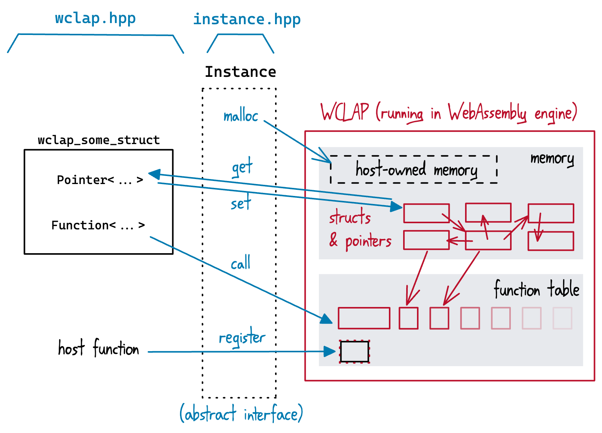

# WCLAP Host C++ headers

This repo contains C++ headers for WCLAP hosts.

Equivalents to all the CLAP types are defined in `wclap/wclap.hpp`.  There are also some completely optional helper classes intended to make writing WCLAP hosts/bridges easier.

## WCLAP C++ types

There are two namespaces `wclap32::` and `wclap64::`, containing `struct`s/`typedef`s with the `clap_...` prefix changed to `wclap_`.  These are translated from the CLAP headers by a (fairly blunt) JS script in `dev/`, which you shouldn't need to run yourself.

Even when the pointer size matches, the CLAP structures used by a WCLAP generally aren't equivalent to CLAP structures in the host architecture.  Specifically, pointers (and function-pointers) used by the WCLAP don't translate to the host, since they're relative to the WASM module's sandboxed memory (or indexes into the function table).

In the WCLAP types, these are therefore represented by `Pointer<>` and `Function<>` wrappers respectively, sized such that (as long as the host architecture is little-endian) the WCLAP structures can be copied bitwise to/from the WASM memory.  While some basic pointer arithmetic is supported, dereferencing/calling these pointers will need WebAssembly-engine-specific logic.

(This is why it's in C++, sorry C/Rust folks.  The `Pointer<>`/`Function<>` templates make this _so_ much nicer.  If it's possible to write something similar in other languages, I'm not the person to do it.)

## Helpers

### `Instance` interface

To actually set/get `Pointer<>`s, or call `Function<>`s, you need an `Instance`.  This defined in `wclap/instance.hpp`, and _mostly_ forwards directly to an underlying implementation, with the exception of:
* `instance.init()` -> `impl.init32()` or `impl.init64()` as appropriate
* `instance.get()`/`.set()` -> forward to `.getArray()`/`.setArray()` with length 1

The idea is to abstract "a WCLAP running in some unknown WASM engine", making it easier to write a host and swap the WASM engine out later.  WASI support is up to the `Instance`, and there may be some implementation-specific config there:

Host functions can only be registered before calling `Instance::init()`.  This will produce different `Function<>` values when registered on different `Instance`s, so they must be stored per-instance.

If a WCLAP spawns a new thread, the `Instance` should handle this internally.  A thread spawned by one `Instance` _must_ not rely on being able to call methods on other `Instance`s.

### `IndexLookup<T>`

WCLAP hosts need to insert their own structures (e.g. `clap_host`) in the WCLAP memory, and the WCLAPs will point to those structures when calling host functions, but they shouldn't be trusted to pass valid/safe values.

This is a simple helper which lets you stick integer indices in the `void *` context fields of various CLAP host structures.  When a host function is called, you can then locate the corresponding plugin/etc. by index, with straightforward bounds checks for safety.

### `MemoryArenaPool` and `MemoryArena`

Each `MemoryArena` owns a chunk of the WCLAP's memory, and can use it to write function arguments or host structures.  These can be obtained (possibly created) from the WCLAP-wide pool, and returned to it when no longer needed.

Plugins should reserve an arena for their lifetime, both for persistently storing that plugin's host structs, and to lock and write arguments to when making realtime-thread function calls (since that arena is known to be available).
